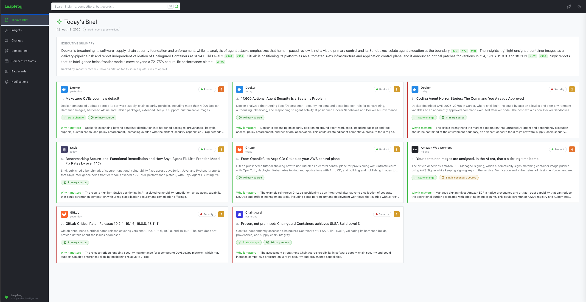
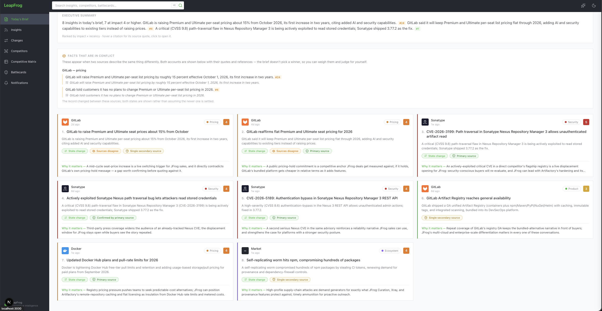
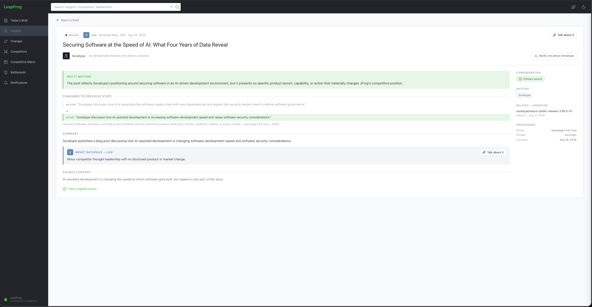
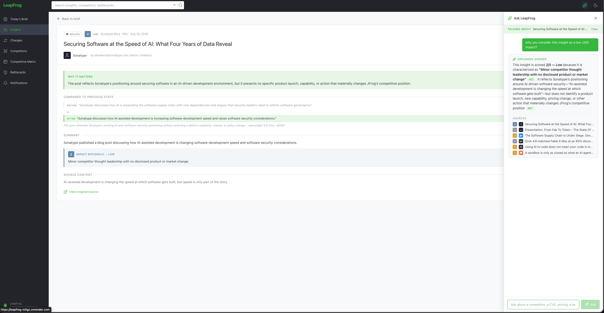
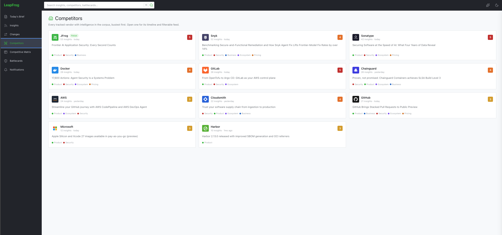
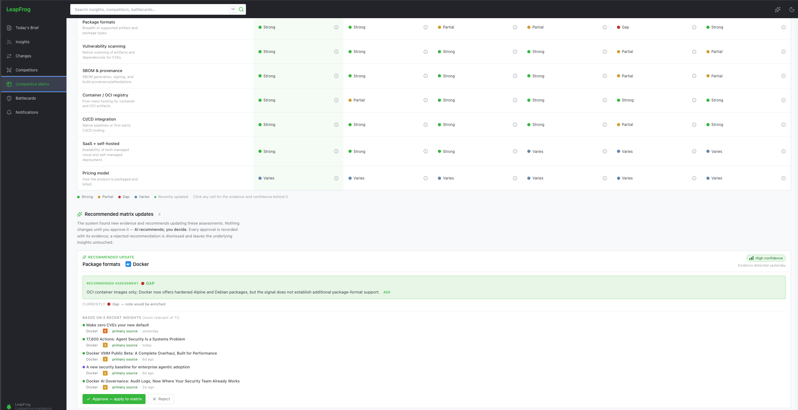
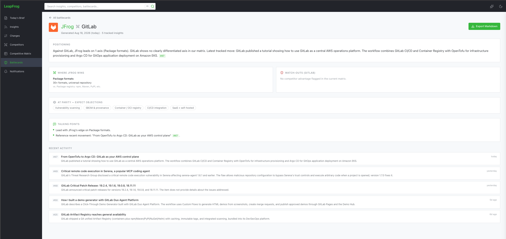
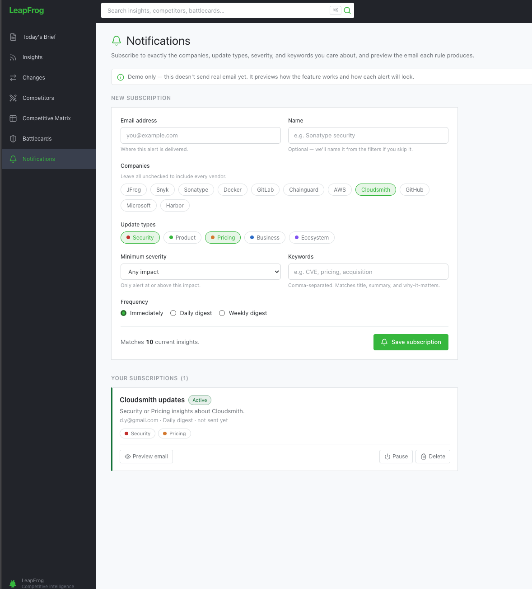
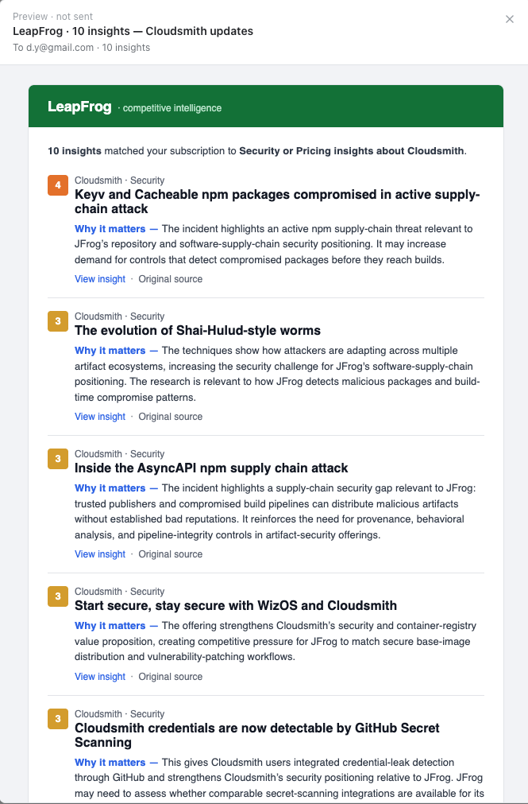

<div align="center">

# LeapFrog

**Competitive intelligence for the software-supply-chain & artifact-management market.**

LeapFrog tracks JFrog and its main competitors, scores what changed and _why it matters
to JFrog_, and turns raw signals into sales- and strategy-ready artifacts — proactive
daily briefs, grounded Q&A, a comparison matrix, and battlecards.


</div>

---

## Highlights

- **Proactive, not a search box.** The home screen is _Today's Brief_ — a ranked,
  category-grouped, cited digest of what changed and why it matters to JFrog.
- **Grounded by design.** Every generated claim cites a real source item; the assistant
  refuses ("not in my sources") rather than hallucinating. LLM output is schema-validated
  before it is ever shown.
- **Conflicts surfaced, never resolved.** When two sources make opposing claims, the brief
  shows both sides with their quotes and citations and lets _you_ decide — it never lets the
  model silently pick a winner or assume the newer post is settled.
- **Runs with zero keys.** `npm run seed && npm run dev` gives a fully populated UI in
  under a minute. Embeddings use OpenRouter when a key is set and fall back to a local
  model without one; only live generation strictly needs a key.
- **Hybrid retrieval.** BM25 (SQLite FTS5) + vector search (sqlite-vec) with metadata
  pre-filtering, so exact identifiers _and_ semantic questions both work.
- **Config, not code.** Swap LLM providers/models with an env change — no source edits.

## By the numbers

A single end-to-end run — ingest → normalize/dedupe → LLM enrich → impact-score (1–5) →
diff (state-change detection) → compose brief — turns raw signals into a full, cited
workspace:

| Metric                 | Typical run                                                                     |
| ---------------------- | ------------------------------------------------------------------------------- |
| **Signals ingested**   | ~400 raw signals across 10 tracked competitors                                  |
| **Insights processed** | ~400 enriched, impact-scored, and diffed against their previous state           |
| **Wall-clock time**    | ~15 minutes end to end                                                          |
| **Cost**               | ~$1 on a top-tier model (e.g. `openai/gpt-5.6-luna`)                            |
| **Output**             | Ranked daily brief, comparison matrix, per-competitor battlecards, grounded Q&A |

Because every stage is idempotent, re-running only pays for what actually changed.

## Quick start

> No API key required — the bundled snapshot of real, pre-enriched signals runs the whole
> product locally.

```bash
npm install
npm run seed     # load committed data + build the retrieval index
npm run dev      # open http://localhost:3000
```

`seed` populates a local SQLite database and builds the index (embeddings go through
OpenRouter when `OPENROUTER_API_KEY` is set, otherwise a local transformers.js fallback —
no key needed); `dev` serves the UI. Everything you see is grounded in the seeded corpus.

## Using the web UI

Open <http://localhost:3000>. The app is organized as a proactive-first workspace:

| Page                                 | What it does                                                                                                                                       |
| ------------------------------------ | -------------------------------------------------------------------------------------------------------------------------------------------------- |
| **Today's Brief** (`/`)              | The home screen: a ranked, cited digest of what changed, each item scored 1–5 for impact on JFrog with a "why it matters" note.                    |
| **Insights** (`/insights`)           | The full feed of enriched items with filters (vendor, category) and sorting. Open any insight for detail, sources, and corroboration.              |
| **Changes** (`/changes`)             | Material state changes — new vs. update vs. re-phrasing — so real news is distinguished from noise.                                                |
| **Competitors** (`/competitors`)     | Every tracked vendor with intelligence in the corpus, busiest first; open one for its timeline and filterable feed.                                |
| **Competitive Matrix** (`/matrix`)   | JFrog vs. competitors across capability axes, with confidence, evidence, and recommended updates drawn from recent insights.                       |
| **Battlecards** (`/battlecards`)     | One-click, source-footnoted sales battlecard per competitor, refreshable from the latest corpus.                                                   |
| **Ask** (`/ask`)                     | Hybrid RAG chat over the corpus. Every answer cites its sources and refuses ("not in my sources") when the corpus has nothing relevant.            |
| **Notifications** (`/notifications`) | Subscribe to insights matching a vendor/category and preview the digest email each rule produces; live delivery turns on with a key in production. |

## Screenshots

### Today's Brief



The home screen: an executive summary followed by a ranked, category-grouped feed. Every
card carries a 1–5 impact score, a "why it matters to JFrog" note, a state-change tag
(new / update / re-phrasing), and a source badge.

### Sources disagree — surfaced, not resolved



When two sources make genuinely opposing claims — a negation flip, opposite-polarity terms
on the same axis (raised vs. flat, launched vs. discontinued, confirms vs. denies), or
diverging figures — the brief opens a **"Facts that are in conflict"** panel. Each side is
shown with its own verbatim quote and citation, and the detected evidence is spelled out in
the note. The system deliberately **does not let the LLM decide what's true**: it presents
both accounts and lets the reader weigh them, rather than silently collapsing to "the latest
wins". A mere refinement of an earlier post is _not_ flagged (see
[`docs/PITFALLS.md`](docs/PITFALLS.md)) — only real contradictions are.

### Insight detail



Open any insight for the full enrichment — "why it matters", a before/after "compared to
previous state" diff, the summary, the impact rationale, and full provenance (source
entities, corroboration, and the exact model, prompt version, and enrich date behind it).

### Ask — contextual, grounded chat



A "Talk about it" panel opens in-context on any insight. Answers are grounded: every claim
cites the corpus items it came from, and the assistant explains its impact scoring rather
than hallucinating.

### Competitors



Every tracked vendor with intelligence in the corpus, busiest first, each with its insight
count, latest headline, and category mix. Open one for its timeline and filterable feed.

### Competitive Matrix — human-in-the-loop



JFrog vs. competitors across capability axes (Strong / Partial / Gap / Varies) with
evidence behind every cell. When new signals arrive the system proposes matrix updates —
**AI recommends, you decide**: each recommendation is backed by recent insights and only
applied on approval.

### Battlecards



A one-click, source-footnoted sales battlecard per competitor: positioning, where JFrog
wins, watch-outs, points at parity, ready-to-use talking points, and recent activity —
exportable to Markdown.

### Notifications



Subscribe to exactly the companies, update types, severity, and keywords you care about,
with immediate / daily / weekly frequency. Each rule shows how many current insights it
matches before you save.

### Digest email



The email each subscription produces: matched insights with their impact score, category,
and "why it matters", linking back to the insight and the original source.

## How it works

```text
Sources → Ingest → Normalize / Dedupe → LLM Enrich → Index (BM25 + vectors) → Brief · Ask · Battlecards
```

`raw_items` are the immutable system of record; enrichments and chunks are derived,
rebuildable views. Every stage is **idempotent** — re-running is safe and a no-op on
unchanged data. See [`docs/DESIGN.md`](docs/DESIGN.md) for the full design and rationale.

## Live mode (optional)

Demo mode uses committed data and needs zero keys. To run the real pipeline against live
sources, set an OpenRouter key and flip the toggle:

```bash
cp .env.example .env
# in .env:  INGEST_LIVE=1  and  OPENROUTER_API_KEY=sk-or-...
npm run ingest && npm run enrich && npm run embed && npm run brief
```

Embeddings always run locally (no embeddings key). Only **generation** (enrichment, chat,
battlecards) uses `OPENROUTER_API_KEY`, and every LLM-backed feature has a deterministic,
grounded fallback when the key is absent — so the app never blocks on a key and never
shows unvalidated output. Models are **config, not code**: swap `OPENROUTER_ENRICH_MODEL`
/ `OPENROUTER_CHAT_MODEL` for any OpenRouter model in [`.env.example`](.env.example)
without touching source.

## Running the pipeline

The worker exposes each pipeline stage as a command:

```bash
npm run fetch      # run source adapters, print results, no DB writes (smoke test)
npm run ingest     # fetch, normalize, dedupe, persist into data/leapfrog.sqlite
npm run enrich     # classify, score, and summarize (needs a key; see live mode)
npm run diff       # detect new vs. update vs. re-phrasing (key-free)
npm run embed      # chunk and embed into the retrieval index (local, key-free)
npm run brief      # compose today's ranked, cited brief (key-free)
npm run notify     # email subscriptions their new matching signals (needs RESEND_API_KEY)
npm run ask -- --q "what changed at Sonatype?"   # hybrid RAG answer with citations
npm run battlecard -- --vendor Sonatype          # generate a battlecard
```

Filters like `--kind <rss|github|nvd>`, `--match <text>`, and `--max <n>` scope any stage.
`GITHUB_TOKEN` and `NVD_API_KEY` are optional and only raise source rate limits.

## Tracked competitors

JFrog is the configurable **focus vendor**. The initial set is the ten vendors in real
head-to-head competition with JFrog across artifact management, registries, and
software-supply-chain security:

> **Sonatype** · **GitHub** · **GitLab** · **AWS** · **Microsoft / Azure** · **Docker** ·
> **Cloudsmith** · **Harbor** · **Snyk** · **Chainguard**

The set is seed configuration (rows in the `sources` table /
[`catalog.ts`](packages/core/src/ingest/catalog.ts)), not hard-coded logic.

## Tech stack

| Layer         | Choice                                                    |
| ------------- | --------------------------------------------------------- |
| Language      | TypeScript · Node 22 · npm-workspaces monorepo            |
| Web / UI      | Next.js (App Router) · Tailwind · shadcn/ui               |
| Worker        | Plain TS pipeline, one command per stage                  |
| Data & search | SQLite (better-sqlite3) · Drizzle ORM · FTS5 · sqlite-vec |
| Embeddings    | OpenRouter `text-embedding-3-small` (local fallback)      |
| Generation    | OpenRouter (OpenAI-compatible) — provider-agnostic        |

## Deploying a shareable link

The app ships as one Docker image with two roles (web + pipeline worker). Run it locally
with `docker compose up`, or one-click deploy to Render as a password-protected demo — see
[`docs/DEPLOY.md`](docs/DEPLOY.md). Set `DEMO_USER` / `DEMO_PASS` to gate a hosted URL.

## Quality gates

```bash
npm run typecheck
npm run lint
npm test
npm run eval       # scores the golden change-classification dataset (key-free)
```

CI (GitHub Actions) runs typecheck, lint, format check, and tests on every push and PR.

## Documentation

- **Design & rationale** — [`docs/DESIGN.md`](docs/DESIGN.md)
- **Architecture diagram** — [`docs/diagrams/architecture.md`](docs/diagrams/architecture.md)
- **Deploying a shareable link** — [`docs/DEPLOY.md`](docs/DEPLOY.md)
- **Decisions (ADRs)** — [`docs/adr/`](docs/adr/)
