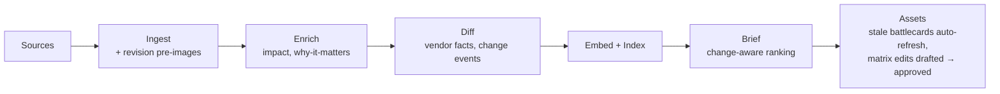

# LeapFrog — Gap Plan: from "grounded brief" to change intelligence

> How we close the distance between what LeapFrog does today and the full problem
> statement: *a system that identifies a material competitive change, verifies it with
> evidence, compares it to the previous state, explains the implication for JFrog, and
> updates the relevant intelligence asset.*
>
> Every item below is scoped to home-assignment constraints: buildable and demonstrable
> in hours (not weeks), runnable with **zero API keys**, with a defensible "why" and a
> clear build-now / future-work split.

## 1. Where we stand

| Pillar (from the problem statement) | Today | Gap |
|---|---|---|
| 1. Identify a **material** competitive change | ⚠️ Partial — per-item `impact_score`, ranked brief | No "new vs. re-phrasing" judgment |
| 2. **Verify** with evidence | ⚠️ Partial — citations validated, zod + quarantine, refusal | No cross-source corroboration / primary-source check |
| 3. Compare to the **previous state** | ❌ Missing | No vendor state, no before/after diff |
| 4. Explain the implication **for JFrog** | ✅ `why_it_matters`, focus-vendor scoring | — |
| 5. **Update** the intelligence asset | ⚠️ Partial — battlecard refresh on demand, matrix review hints | No drafted edits, no approval loop, no staleness signal |

Pillars 1–3 collapse into one missing capability — **state + diff** — and pillar 5 into a
second — **close the asset loop**. That framing keeps the plan small (two features, one
cross-cutting trust upgrade) instead of five separate projects.

## 2. Design constraints (non-negotiable, from our rules)

1. **Demo-mode first**: every feature works with zero keys via a deterministic, grounded
   fallback. Local embeddings (transformers.js) are key-free, so similarity-based logic
   is *always* available.
2. **Raw immutable, derived rebuildable**: new tables are either append-only records
   (system of record) or derived views that `--rebuild` can regenerate. Never write
   derived data back into `raw_items`.
3. **LLM output is never trusted**: every new model call gets a versioned prompt in
   `prompts/*.md`, a zod schema, quarantine on failure, and citation validation. Log
   `model`, `promptVersion`, `requestId`, `latencyMs`, token counts on every row.
4. **Config, not code**: new models and thresholds are env vars with sensible defaults.
5. **Idempotent stages**: each new pipeline stage selects only pending work, upserts on
   a stable key, and accepts `changedIds`. Re-running is a no-op on unchanged data.
6. **Evaluate before ship**: golden-dataset entries land with the feature; no prompt
   merges without `npm run eval` covering it.
7. **UI that passes the trunk test**: plain page names ("Changes", not "Delta Radar"),
   scannable cards, obvious buttons, persistent nav, "you are here" state.
8. **YAGNI**: no speculative tables or abstractions. Anything computable on read stays
   computed on read until measurement says otherwise.

---

## 3. Feature A — Vendor state & change detection (pillars 1 + 3)

**The claim we want to demo:** *"LeapFrog doesn't just rank news — it tells you whether
something actually changed, what it was before, and whether the wording is just new
paint."*

### 3.1 Data model

Two additions, both honoring "immutable inputs, append-only outputs":

- **`raw_item_revisions`** (append-only pre-images, system of record). Today a revised
  raw item is overwritten in place and the old text is lost — which quietly weakens the
  "raw is immutable" contract. On every `revised` upsert, write the *previous* content
  columns into this table inside the same transaction. Cost: one insert; benefit: a
  deterministic textual diff is always available, key-free.

- **`vendor_facts`** (derived, rebuildable). The distillation pattern: convert
  high-volume items into discrete, queryable knowledge units. One row = one current
  claim about a vendor on one dimension:

  ```
  vendor_facts: id, vendor, dimension (pricing|capability|release|security|positioning),
                fact TEXT, evidenceItemId → raw_items.id, validFrom,
                supersededByFactId (nullable), createdAt
  ```

  Current state = rows where `supersededByFactId IS NULL`; history = the supersede
  chain. Append-only with a pointer (log-compaction style) instead of update-in-place,
  so "what did we believe on date X" is always answerable and the table is rebuildable
  from `raw_items` + `enriched_items`.

- **`change_events`** (derived). The product-facing output of the diff stage:

  ```
  change_events: id, vendor, dimension, kind (new|update|rephrase|duplicate),
                 before TEXT (nullable), after TEXT, materiality 1–5, rationale,
                 triggerItemId → raw_items.id, previousFactId, newFactId,
                 status (ok|quarantined), quarantineReason,
                 model, promptVersion, requestId, latencyMs, promptTokens,
                 completionTokens, createdAt
  ```

### 3.2 Pipeline stage: `worker diff`

New stage between enrich and brief. Idempotent: selects enriched items with no change
event yet (plus explicit `changedIds`), upserts on `triggerItemId`.

```
Sources → Ingest → Enrich → **Diff** → Embed → Brief
```

**Demo mode (no key) — deterministic and grounded:**
1. *Revised items*: sentence-level textual diff of the stored pre-image
   (`raw_item_revisions`) vs. the new content → `kind=update`, `before`/`after` are the
   changed sentences verbatim. Zero inference, fully explainable.
2. *New items*: nearest-neighbor search with the existing local embeddings, pre-filtered
   by vendor (never query vectors without a metadata filter). Similarity ≥
   `DIFF_SIMILARITY_THRESHOLD` to an older item → `kind=rephrase` (cite the older item);
   below → `kind=new`. Materiality inherits `impact_score`.

**Live mode (key present):** `prompts/diff.md` (versioned, `diff@1`) receives the new
item *plus* the vendor's current facts and the top similar prior items (retrieved, not
recalled — groundedness first), and returns structured JSON:

```json
{ "kind": "update", "dimension": "pricing", "before": "…", "after": "…",
  "materiality": 4, "rationale": "…", "evidence_item_ids": [12, 87] }
```

zod-validated; `evidence_item_ids` must resolve to items actually shown to the model or
the row is quarantined. On any failure the deterministic path above is the fallback —
the diff stage, like the brief, is *always producible*.

The prompt includes negative constraints ("never infer a prior state that is not in the
supplied facts; if there is no prior fact, `kind` must be `new`") and edge-case few-shot
examples (a pure re-wording, a version bump with no feature change).

**Config:** `OPENROUTER_DIFF_MODEL` (defaults to `OPENROUTER_ENRICH_MODEL`),
`DIFF_SIMILARITY_THRESHOLD` (default `0.92`). No model slug in code.

### 3.3 UI

- **Changes page** (new, in the sidebar): a scannable feed of change cards —
  vendor, dimension badge, materiality badge, and a before → after pair rendered as two
  short quoted lines. `rephrase`/`duplicate` events are collapsed under a muted
  "3 re-phrasings filtered" row: the noise-filtering is *visible*, which is the demo
  moment. Every card links its evidence items.
- **Signal detail**: a "Compared to previous state" block when a change event exists.
- **Today's Brief**: material changes (`kind ∈ {new, update}`, materiality ≥ 4) get a
  "State change" badge so the brief distinguishes *news* from *change*.

### 3.4 Evals

Extend the golden dataset with ~10 labeled pairs: (prior item, new item, expected
`kind`, expected `materiality`). `npm run eval` reports change-classification accuracy
next to the existing enrichment metrics. The deterministic path is unit-tested (vitest)
with fixture revisions — no network, dependencies injected (`Embedder` stub).

### 3.5 Homework fit

~5–6 h: schema + migration (1h), diff stage with deterministic path (2h), prompt + zod +
quarantine (1h), Changes page (1.5h), evals/tests (0.5h). Demoable with zero keys via
seeded revisions in `data/seed`. Defensible why: this is the single highest-leverage
answer to "did something actually happen, or is it just new wording?"

**Cut line:** ship deterministic-only (revision diff + similarity) and defer the LLM
`diff@1` prompt to future work — the feature still demos end-to-end.

---

## 4. Feature B — Corroboration & source tiers (pillar 2)

**The claim we want to demo:** *"Every signal shows whether a primary source confirms
it — grounding tells you where a claim came from; corroboration tells you whether to
trust it."*

### 4.1 Design — computed on read, no new tables

Deliberately schema-free (YAGNI): corroboration is derivable from what we already
store, so we compute it in `packages/core/src/query/` at read time until scale says
otherwise.

- **Source tiers** are static config in `packages/core` (a named constant map, not
  magic strings): `primary` = the vendor's own feed (`sources.vendor` matches the
  signal's vendor), GitHub Releases, NVD CVE records; `secondary` = third-party
  news/blog RSS. This is deterministic and key-free.
- **Corroborating items** for a signal = other items about the same vendor within a
  ±7-day window whose embedding similarity clears the (reused) threshold — the same
  local-embedding machinery as Feature A, filtered before vector search by vendor and
  date.

### 4.2 UI

- Signal detail and brief cards get a **corroboration badge**: "Confirmed by primary
  source" (green) / "Single secondary source" (amber). Plain words, obvious meaning —
  no invented terminology.
- The badge expands to the corroborating items with their tier labels.

### 4.3 Homework fit

~2–3 h, no LLM, no migration, works fully in demo mode. Defensible why: it directly
answers "מה המקור האמין?" and addresses the trust statistics in the problem statement
without adding a single ungrounded claim.

**Future work:** claim-level (not item-level) corroboration via an LLM entailment
check — versioned prompt, zod, quarantine — once item-level proves useful.

---

## 5. Feature C — Closing the asset loop (pillar 5)

**The claim we want to demo:** *"When the market moves, the battlecard tells you it's
stale, and the matrix edit is already drafted with citations — the analyst approves,
they don't transcribe."*

The literal ask is "automatically updates the asset." We keep the deliberate trust
stance — the matrix stays a human-owned asset, never machine-written — but shrink the
human's job from *writing* to *approving*. This is a strength to present, not a
compromise: it is exactly the answer to "76% received AI output they couldn't stand
behind." Derived assets (battlecards) auto-refresh, because they are rebuildable views;
curated assets (the matrix) get **drafted, cited edits behind an approval gate**.

### 5.1 Battlecard staleness + auto-refresh

- A battlecard already recomputes from the corpus. Add a **staleness check** (pure
  computation, key-free): count signals for that vendor newer than `generatedAt`. The
  UI shows "3 new signals since this card was generated — Refresh" with a one-click,
  obviously-clickable button; the worker's scheduled run regenerates stale cards
  automatically since the card is fully derived and citation-safe by construction.

### 5.2 Matrix: drafted edits + approval gate + audit trail

- Upgrade `suggestMatrixUpdates` output from "revisit this cell" to a **drafted edit**:
  proposed `{level, note}` next to the current cell, with the driving signal cited.
  - *Demo mode:* deterministic draft — level unchanged, note = current note + an
    appended cited sentence from the signal's validated summary.
  - *Live mode:* `prompts/matrix-edit.md` (`matrix-edit@1`) writes a concise
    replacement note; zod-validated, citations must resolve to the driving signals,
    fallback to the deterministic draft.
- **Approve** (a real button, in a "Pending updates" panel on the Comparison page)
  applies the edit to the curated matrix and appends a row to a new append-only
  **`asset_revisions`** table (`assetKind`, `assetKey`, `before`, `after`,
  `suggestionId`, `createdAt`) — separate the command (approval, validated
  synchronously) from the event (the immutable revision record). **Reject** records
  the dismissal so the same suggestion doesn't resurface — the seed of the analyst
  feedback loop already listed in DESIGN.md future work.
- The matrix page shows "last updated / by which approval" per cell on hover — the
  audit trail is user-visible, which reinforces the trust story in the presentation.

### 5.3 Homework fit

~4–5 h: staleness check + refresh button (1h), drafted edits with deterministic path
(1.5h), approval flow + `asset_revisions` (1.5h), matrix-edit prompt + zod (1h).

**Cut line:** ship staleness + approval of *deterministic* drafts; defer the
`matrix-edit@1` prompt. The loop still closes end-to-end with zero keys.

---

## 6. Pillar 4 follow-up (optional stretch)

`why_it_matters` already answers "So what?". The remaining analyst question — "What
should JFrog do?" — is deliberately left to human judgment (that is the division of
labor the problem statement itself proposes). If time remains: a clearly-labeled
**"Suggested next step (draft)"** line on impact-≥4 change events, generated only in
live mode, citation-validated, visually marked as a draft. Not required for the story;
cut first.

## 7. Pipeline after this plan



## 8. Issue backlog (one issue → one branch → PR, conventional commits)

| # | Issue (branch) | Feature | Est. | Depends on |
|---|---|---|---|---|
| 18 | `feat/raw-item-revisions` | A | 1h | — |
| 19 | `feat/vendor-facts-change-events` | A | 1h | 18 |
| 20 | `feat/diff-stage` (deterministic path + `worker diff`) | A | 2h | 19 |
| 21 | `feat/diff-prompt` (`diff@1`, zod, quarantine, evals) | A | 1h | 20 |
| 22 | `feat/changes-ui` (Changes page, brief badges) | A | 1.5h | 20 |
| 23 | `feat/corroboration` (tiers + similarity, badges) | B | 2.5h | — |
| 24 | `feat/battlecard-staleness` | C | 1h | — |
| 25 | `feat/matrix-drafted-edits` (deterministic draft + approval + audit) | C | 3h | — |
| 26 | `feat/matrix-edit-prompt` (`matrix-edit@1`) | C | 1h | 25 |
| 27 | `chore/seed-change-fixtures` (seeded revisions so demo mode shows diffs) | A | 0.5h | 20 |

Total build-now core: **~14.5 h** — an aggressive but honest two-day extension, with cut
lines already marked (21, 26, and §6 drop first; every feature still demos without
them). After each issue: `npm run typecheck`, `npm run lint`, `npm test` before commit.

## 9. What we demo, per feature (assignment: "actual UI", screenshots, defend the why)

| Feature | 30-second demo moment | The "why" to defend |
|---|---|---|
| A — Change detection | Open **Changes**: a pricing before → after card next to a collapsed "re-phrasings filtered" row | Answers "did something actually change?" — the analyst's core question; deterministic core, LLM only as an upgrade |
| B — Corroboration | A brief card flips open: "Confirmed by primary source (NVD)" | Trust is the product; source tiering is free, grounded, and key-free |
| C — Asset loop | Battlecard banner "3 new signals — Refresh"; approve a drafted matrix edit; hover shows the audit trail | Auto-update *without* un-reviewed AI content — directly addresses the AI-trust survey problem |

## 10. Risks & pitfalls

- **False "rephrase" collapses a real change** (similarity over-triggers): threshold is
  config (`DIFF_SIMILARITY_THRESHOLD`), golden pairs pin expected behavior, and
  collapsed rows stay expandable — nothing is hidden, only de-emphasized.
- **Fact extraction drift** (`vendor_facts` quality bounds diff quality): facts are
  derived and rebuildable, so a prompt fix + `--rebuild` recovers the table; quarantine
  keeps bad extractions out of the product meanwhile.
- **Approval fatigue**: at most one drafted edit per (vendor, axis) — the strongest
  signal — same capping rule the suggestion queue already uses.
- **Scope creep**: the cut lines in §3/§5 and the stretch flag in §6 are the contract;
  the two core demo scenarios survive every cut.

## 11. Rules compliance checklist

- Demo-mode first: every feature has a key-free deterministic path (§3.2, §4.1, §5.2).
- Raw immutable / derived rebuildable: revisions & audit are append-only records;
  facts/events are rebuildable views (§3.1, §5.2).
- LLM never trusted: `diff@1`, `matrix-edit@1` versioned in `prompts/`, zod + quarantine
  + citation resolution + full call logging (§3.2, §5.2).
- Config, not code: `OPENROUTER_DIFF_MODEL`, `DIFF_SIMILARITY_THRESHOLD`; no slugs or
  magic numbers in code paths.
- Idempotent stages with `changedIds`; DI (`Embedder`, model interfaces) so tests never
  touch the network.
- Retrieval: metadata pre-filter before every vector query; hybrid machinery reused,
  not duplicated.
- Evals: golden change-pairs land with the feature; no prompt ships without
  `npm run eval`.
- UX: plain names, scannable cards, real buttons, visible trust indicators; new pages
  pass the trunk test from persistent nav.
- YAGNI: corroboration computed on read; no speculative tables; stretch items flagged
  and cut first.

## 12. Related documents

- Current design: [`docs/DESIGN.md`](DESIGN.md)
- Original build plan: [`docs/diagrams/build-plan.md`](diagrams/build-plan.md)
- Decisions: [`docs/adr/`](adr/)
