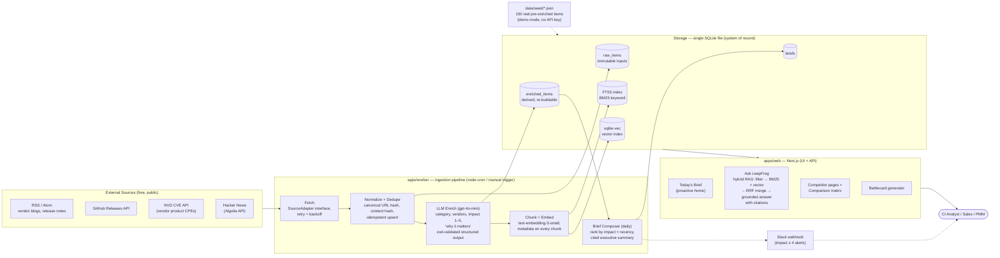
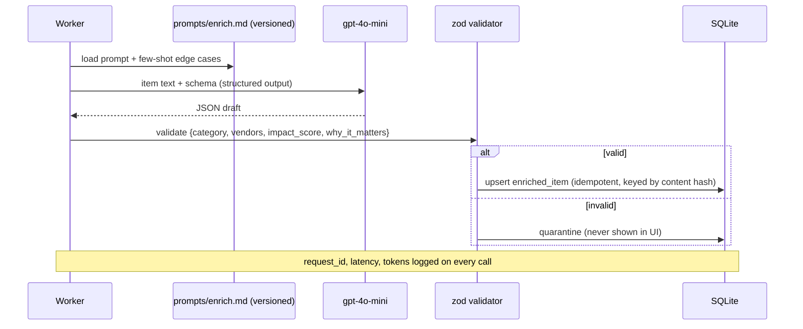
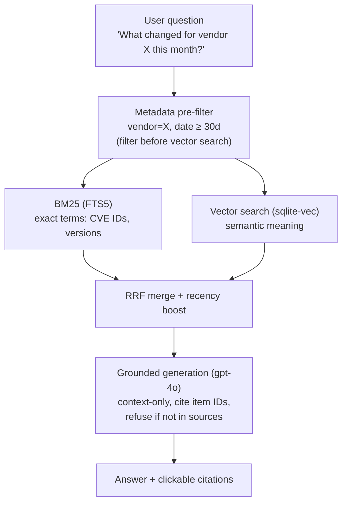
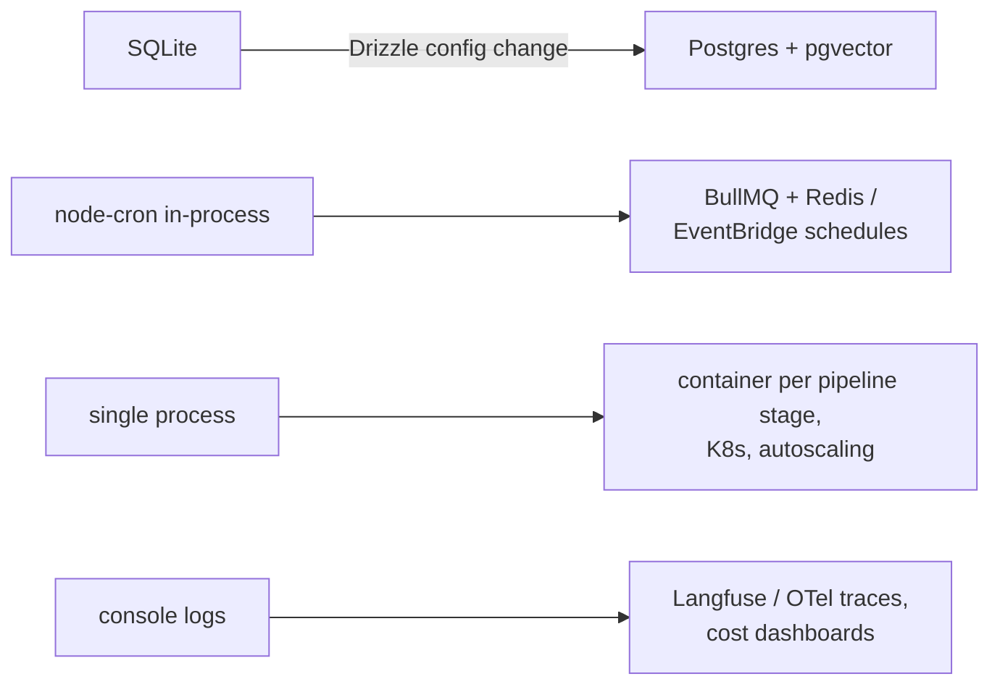

# LeapFrog — Architecture

> Diagrams are Mermaid: text-based, diffable in PRs, and rendered natively by GitHub.

## System architecture

## Enrichment call — the guarded LLM boundary

## Ask LeapFrog — hybrid retrieval

## Production evolution (next step, not built)

