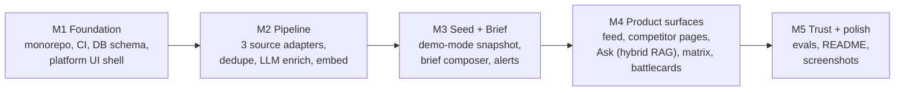
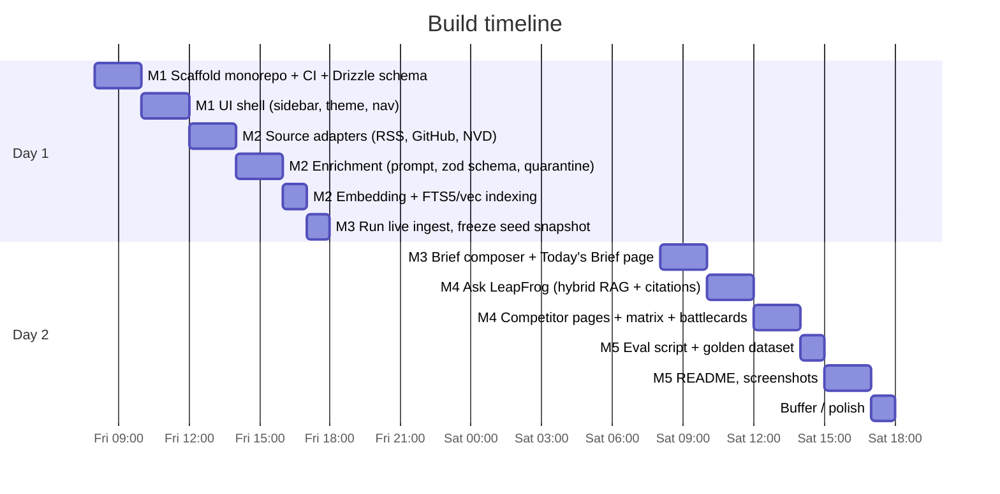

# LeapFrog — Build Plan

Workflow: **GitHub issue → branch → PR → squash-merge**, conventional commits, CI green
from commit #1.

## Milestones and dependencies

## Timeline (focused build, ≈2 days)

## Issue backlog (create these on day 0)

| # | Issue (branch) | Milestone | Notes |
|---|---|---|---|
| 1 | `chore/scaffold-monorepo` | M1 | npm workspaces: `apps/web`, `apps/worker`, `packages/core`; tsconfig, eslint, prettier |
| 2 | `chore/ci-pipeline` | M1 | Actions: typecheck, lint, test on PR |
| 3 | `feat/db-schema` | M1 | Drizzle: sources, raw_items, enriched_items, chunks, briefs; FTS5 + sqlite-vec setup |
| 4 | `feat/ui-shell` | M1 | Dark sidebar, green accent, top bar, routing skeleton |
| 5 | `feat/source-adapters` | M2 | `SourceAdapter` interface; RSS, GitHub Releases, NVD; retry/backoff |
| 6 | `feat/normalize-dedupe` | M2 | URL/content hash, idempotent upsert |
| 7 | `feat/llm-enrichment` | M2 | versioned prompt, structured output, zod validation, quarantine, call logging |
| 8 | `feat/embed-index` | M2 | chunking, metadata, embedding, dual index |
| 9 | `feat/seed-demo-mode` | M3 | freeze real ingested data into `data/seed`, `npm run seed` |
| 10 | `feat/brief-composer` | M3 | rank impact × recency, cited exec summary, Slack webhook hook |
| 11 | `feat/todays-brief-ui` | M3 | home page, signal detail view |
| 12 | `feat/ask-rag` | M4 | hybrid retrieval, RRF, grounded chat, citations, refusal path |
| 13 | `feat/competitor-pages` | M4 | timeline per vendor, filterable feed |
| 14 | `feat/comparison-matrix` | M4 | curated axes + suggested updates (human-approved) |
| 15 | `feat/battlecards` | M4 | generate/refresh from corpus, export markdown |
| 16 | `feat/evals` | M5 | golden dataset, classification accuracy, faithfulness judge, `npm run eval` |
| 17 | `docs/readme` | M5 | README (setup < 5 min), screenshots |

## Cut lines (if time runs short — in cut order)

1. Comparison-matrix *auto-suggestions* → ship curated static matrix
2. Slack webhook → in-app alerts only
3. HN adapter → keep RSS + GitHub + NVD
4. Battlecard *export* → on-screen only

The two core scenarios survive every cut: they need the brief, one competitor page, Ask,
and one battlecard.
