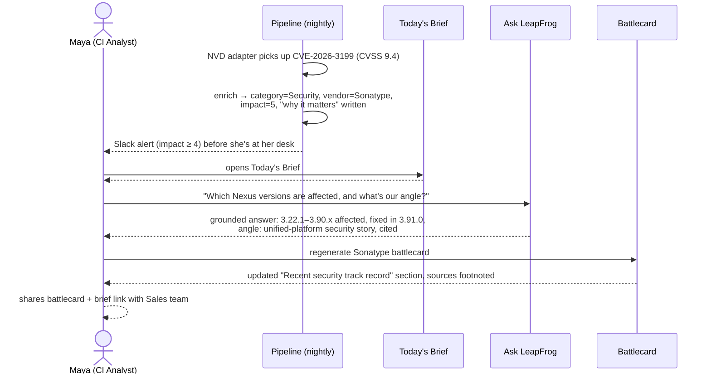
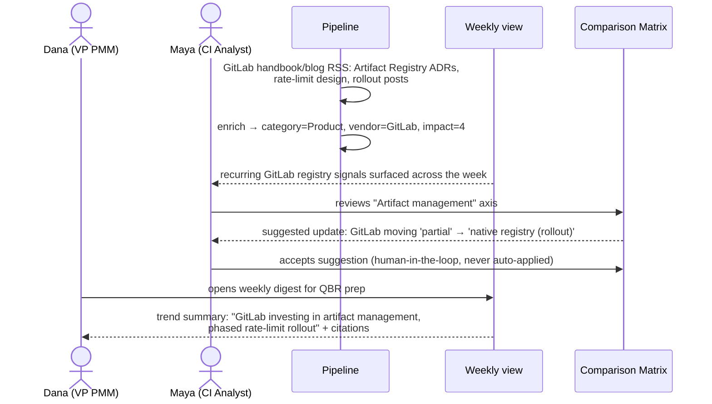
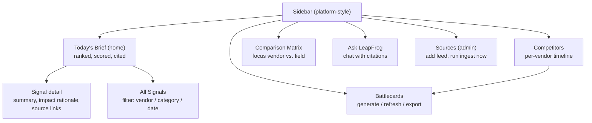

# LeapFrog — Product Scenarios

Both scenarios are built on **real 2026 events** so every screen shows verifiable data with
live source links. They illustrate the product's proactive-first flow end to end.

## The product in one picture (proactive-first)

```mermaid
journey
    title A day with LeapFrog — Maya, CI Analyst
    section 08:30 — Proactive
      Slack alert, critical competitor CVE: 3: LeapFrog
      Opens Today's Brief, 5 ranked items: 5: Maya
      Reads "why it matters": 5: Maya
    section 09:00 — Investigate
      Drills into competitor page: 4: Maya
      Asks follow-up in chat, gets cited answer: 5: Maya
    section 09:15 — Act
      Regenerates the competitor battlecard: 5: Maya
      Shares brief link with Sales: 5: Maya, Tom
    section Later — Passive
      Tom checks battlecard before a deal call: 5: Tom
      Dana reviews weekly trends and matrix: 4: Dana
```

## Scenario 1 — Competitor security incident (Nexus CVE-2026-3199 / CVE-2026-5189)

Two critical CVEs (CVSS 9.4 RCE and 9.2 hardcoded credential) disclosed against
Sonatype Nexus Repository in April 2026.



**The point being demonstrated:** the system found it, scored it, explained it, and produced
a sales-ready artifact — before the analyst asked anything.

## Scenario 2 — Strategic product move (GitLab Artifact Registry rollout)

GitLab is rolling out a new Artifact Registry through 2026 — a head-on move into the
artifact-management market. Slower-burning than a CVE, caught as a **trend**.



**The point being demonstrated:** not just alerting — trend detection, a living comparison
matrix, and a human-in-the-loop for anything that changes stated positioning.

## Information architecture (what the user sees)


